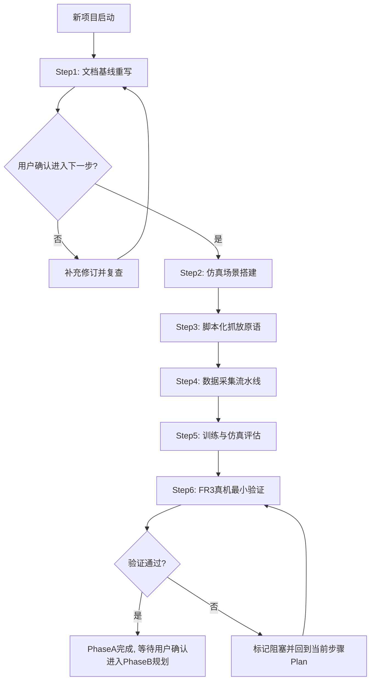

# 项目总计划（Master Plan）

当前步骤：1/6（进行中）

## 1. 项目总目标与完成定义
本项目当前阶段目标是基于 Isaac Sim 跑通 FR3 + 原装夹爪的单方块抓放闭环，并完成一次 FR3 真机最小验证，建立“可规划、可执行、可检查”的端到端流程。项目后续在该基线上扩展至智元灵巧手与更复杂自动化任务。

完成定义（DoD）：
- Step 1~Step 6 全部通过验收，且每步均有可检查产物。
- 仿真环境可稳定完成“抓取 1 个方块并放到指定位置”任务。
- 真机 FR3 至少完成 1 次最小可行抓放验证并产出执行记录与误差说明。
- 文档可支撑新同事或 AI 在 30 分钟内理解当前状态并继续推进。

## 2. 总体步骤拆分（项目级）

### ▶️ Step 1：项目基线与工作流落地
- 步骤目标：重写并对齐 `docs` 主文档，使项目目标、步骤与门禁规则一致。
- 主要产出：更新后的 `master-plan.md`、`overview.md`、`file-map.md`、`step-01-project-baseline.md`。
- 前置依赖：无。
- 关键风险：文档描述与实际执行不一致，导致后续步骤推进混乱。
- 验收标准：四份文档内容一致，步骤口径统一为 1/6，且未预创建后续步骤文档。

### ⬜ Step 2：Phase A-1 仿真场景搭建
- 步骤目标：完成 FR3 + 原装夹爪 + 方块 + 目标放置区的可运行仿真场景。
- 主要产出：场景配置、机器人配置、对象与物理参数基线。
- 前置依赖：Step 1。
- 关键风险：物理参数不合理导致抓放动作在仿真不稳定。
- 验收标准：场景可初始化，FR3 与夹爪可控制，方块与目标区状态可读取。

### ⬜ Step 3：Phase A-2 脚本化抓放原语
- 步骤目标：实现并跑通一次完整抓放序列（接近、抓取、抬升、移动、放置、释放）。
- 主要产出：可重复执行的脚本化抓放流程与基础日志。
- 前置依赖：Step 2。
- 关键风险：末端轨迹或夹爪时序不合理导致抓取失败。
- 验收标准：在仿真中可连续成功执行最小抓放任务并记录关键状态。

### ⬜ Step 4：Phase A-3 数据采集流水线
- 步骤目标：围绕抓放原语形成可批量落盘的数据采集流程。
- 主要产出：采集脚本、样本格式、异常重试与落盘规范。
- 前置依赖：Step 3。
- 关键风险：多源状态时间戳不一致影响后续训练可用性。
- 验收标准：可稳定采集多回合数据，输出字段完整且可解析。

### ⬜ Step 5：Phase A-4 策略训练与仿真评估
- 步骤目标：完成最小策略训练与仿真评估，输出可复现指标。
- 主要产出：训练配置、模型产物、评估结果与成功率统计。
- 前置依赖：Step 4。
- 关键风险：奖励与训练参数不合理导致策略不收敛。
- 验收标准：模型可推理，仿真评估指标达到阶段标准并可复算。

### ⬜ Step 6：Phase A-5 FR3 真机最小验证
- 步骤目标：将仿真产出的轨迹或策略桥接到 FR3 真机完成一次最小抓放验证。
- 主要产出：真机执行日志、误差记录、问题清单与后续改进建议。
- 前置依赖：Step 5。
- 关键风险：通信时延与安全约束导致动作中断或失败。
- 验收标准：至少 1 次真机抓放任务完成并形成可追溯验证记录。

### 未来扩展（Phase B，占位，不占步骤序号）
- 切换末端执行器至智元灵巧手。
- 实现自动化测试点位寻找能力。
- 扩展更复杂操作任务并形成新的步骤计划。
- 说明：本节仅为占位方向，细化前不创建 `step-XX-<name>.md`。

## 3. 推进门禁规则（强制）
- 同一时间仅允许一个步骤处于 `▶️ 进行中`。
- 当前步骤未 `✅ 已完成` 前，禁止进入下一步骤。
- 每一步必须先在 Plan 模式细化并列出不确定项，再等待用户选择。
- 未获得用户明确选择前，禁止进入实现阶段。
- 仅在“当前步骤验收通过 + 用户确认进入下一步”后，才创建下一个 `step-XX-<name>.md`。

## 4. Mermaid 项目流程图

## 5. 更新日志
- 2026-04-22 15:45 CST
  - 改了什么：新增总计划文档，定义 7 步总流程与推进门禁。
  - 为什么：将项目推进从“功能内计划”改为“独立计划中枢”。
  - 影响范围：`docs/project_plan/master-plan.md`
- 2026-04-22 22:20 CST
  - 改了什么：将总计划重排为 1/6，聚焦 Phase A（FR3 + 原装夹爪方块抓放）并新增 Phase B 占位章节。
  - 为什么：对齐用户新目标与单步串行推进规则，避免范围过宽导致执行失焦。
  - 影响范围：`docs/project_plan/master-plan.md`
