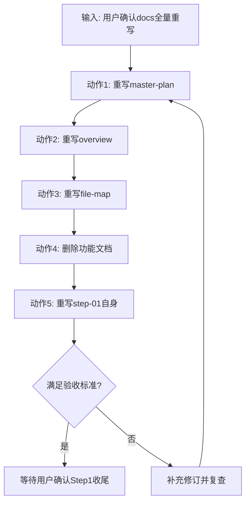

# Step 01：项目基线与工作流落地

当前步骤：1/1（进行中）

## 1. 步骤目标与范围
- 步骤目标：完成 docs 主文档的全量重写与口径统一，使项目目标聚焦 FR3 原装夹爪方块抓放闭环，并清理无代码先建功能文档的历史遗留。
- 本步骤范围：`docs/project_overview/*`、`docs/project_plan/*`。
- 本步骤不包含：业务代码实现、依赖安装、训练脚本落地。

## 2. 不确定项 / 待确认选项（Plan 模式）
本步骤关键决策已由用户确认，记录如下：
1. docs 重构范围：L1（仅对现有 Markdown 内容重写/删除，不扩展目录结构）。
2. Step 1 处理方式：2A（Step 1 定位不变，动作清单整体覆盖替换）。
3. 功能文档处理：删除 `docs/project_detailed/virtual-data-collection-and-training.md`。
4. 空目录处理：方案 c（不放 `.gitkeep` 或 `README.md`）。
5. 主目标骨架：Phase A 五步（仿真场景、抓放原语、数据采集、训练评估、真机最小验证）。
6. 末端策略：Phase A 使用原装夹爪紧耦合实现，不做 EndEffector 抽象。

## 3. 一步一动作执行清单

### ▶️ 进行中 动作 1：重写 master-plan 主计划
- 动作目标：将总步骤统一为 1/6，并把项目目标重排为 Phase A 五步 + Phase B 占位。
- 涉及文件：`docs/project_plan/master-plan.md`。
- 具体操作：改写总目标、DoD、步骤拆分、Mermaid 流程图与更新日志，保持门禁规则不变。
- 依赖前置：无。
- 验收标准：顶部显示 `当前步骤：1/6（进行中）`，Step 2~6 与 Phase A 五步一一对应。
- 风险点：步骤口径变更后与其他文档不同步。

### ▶️ 进行中 动作 2：重写项目总览文档
- 动作目标：让项目总览与新主计划完全一致，明确当前仅聚焦 FR3 方块抓放闭环。
- 涉及文件：`docs/project_overview/overview.md`。
- 具体操作：重写 §1~§7，更新边界、输入输出、主流程和风险描述，进度改为 1/6。
- 依赖前置：动作 1。
- 验收标准：全文不再引用已删除功能文档，且所有进度口径与主计划一致。
- 风险点：概述层面仍保留历史目标，导致读者误判范围。

### ▶️ 进行中 动作 3：重写结构导航文档
- 动作目标：将目录与步骤映射改为 1/6 新结构，删除已失效功能文档条目。
- 涉及文件：`docs/project_overview/file-map.md`。
- 具体操作：更新目录树、关键文件职责、步骤映射，保留核心符号索引并标注待代码落地替换。
- 依赖前置：动作 1。
- 验收标准：`file-map.md` 不再出现 `project_detailed/virtual-data-collection-and-training.md`。
- 风险点：目录映射与主计划步骤编号不一致。

### ▶️ 进行中 动作 4：删除提前创建的功能文档
- 动作目标：回滚“无代码先建功能文档”的不合规状态，恢复规则三执行一致性。
- 涉及文件：`docs/project_detailed/virtual-data-collection-and-training.md`。
- 具体操作：删除该文件，不保留占位文件。
- 依赖前置：动作 2、动作 3。
- 验收标准：该文件在仓库中不存在，且 `docs/project_detailed/` 不再被其他文档引用。
- 风险点：删除后若有残留引用，会导致导航文档失效。

### ▶️ 进行中 动作 5：重写当前 step-01 文档本身
- 动作目标：让 step-01 的计划描述与本轮真实执行完全一致，形成可追溯记录。
- 涉及文件：`docs/project_plan/step-01-project-baseline.md`。
- 具体操作：重写步骤目标、不确定项、动作清单、验收标准、Mermaid 图与更新日志。
- 依赖前置：动作 1、动作 2、动作 3、动作 4。
- 验收标准：原动作 1/2/3 描述不再保留，文档内容与本轮执行一致。
- 风险点：若未同步更新日志，后续难以追溯本次重构原因。

## 4. 验收标准（步骤级）
- `docs/project_plan/` 存在且包含 `master-plan.md` 与 `step-01-project-baseline.md`。
- `master-plan.md` 顶部口径为 `1/6`，且 Step 2~Step 6 对应 Phase A 五步。
- `overview.md` 与 `file-map.md` 完全对齐新主计划，不含已删除功能文档引用。
- `docs/project_detailed/virtual-data-collection-and-training.md` 已删除。
- 未创建 `step-02` 及之后文档。

## 5. 风险与降级方案
- 风险：文档改动范围大，易出现章节间口径不一致。
- 降级方案：以 `master-plan.md` 为单一真源，逐文档比对并回写。

## 6. Mermaid 步骤流程图

## 7. 更新日志
- 2026-04-22 15:46 CST
  - 改了什么：新增 step-01 计划文档，记录当前步骤的目标、不确定项与动作清单。
  - 为什么：落实“先当前步、后下一步”的单步串行推进机制。
  - 影响范围：`docs/project_plan/step-01-project-baseline.md`
- 2026-04-22 22:20 CST
  - 改了什么：按用户确认结果全量重写 step-01 内容，动作清单改为本轮 5 个重构动作并纳入功能文档删除动作。
  - 为什么：使步骤计划与实际执行一致，修复“无代码先建功能文档”带来的规则偏差。
  - 影响范围：`docs/project_plan/step-01-project-baseline.md`
